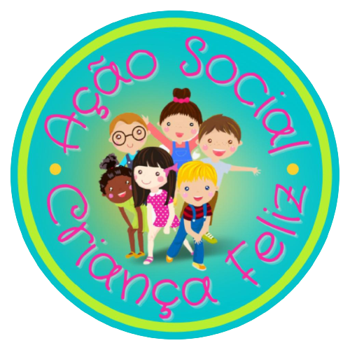

<h1 align="center">Natal Feliz das Crianças</h1>

  

# Proposta

Projeto Conclusão do Curso: Turma 21 - Imersão JavaScript {Reprograma} | Dezembro 2022 | Autora: [Bárbara Pereira](https://github.com/barbara-pereira)

### Objetivo

Desenvolver uma aplicação para cadastrar padrinhos e crianças para doação de sacolinhas de Natal

### Qual problema resolver com o projeto?

Organizar e otimizar o cadastro de padrinhos e crianças para a doação de sacolinhas de Natal, de forma organizada, facilitando a comunicação e confirmação dos participantes

### Resumo

O que o sistema terá?
- [Detalhes do Projeto Social](#detalhes-do-projeto-social)
- [O que quero Resolver](#o-quero-resolver)
- [Informações Técnicas](infomações-técnicas)
  - [Classe Pessoa](#classe-pessoa)
  - [Classe Padrinho](#classe-padrinhes)  
  - [Classe Criança](#classe-crinaça)
  - [Conectar padrinhos e crianças](#conectar-padrinhos-e-crianças)

- [Evolução do Projeto](evolução-d-projeto)
 ---
 
## Detalhes do Projeto Social

Nosso projeto [Criança Feliz]("https://www.instagram.com/criancafeliz.as/) começou através da iniciativa da pela iniciativa da minha irmã de religião [Catia]("https://www.instagram.com/catia_520/") ao saber que a Mãe quando criança não tinha um Natal de qualidade por não ter condições financeiras e a Catia por muitas vezes não ganhava um presente de Natal e isso me fez refletir quanto isso é importante para uma criança e esse lúdico nós não podemos deixar morrer e observando a nossa volta no nosso próprio bairro quantas crianças mais não podem viver esse sonho. E assim começamos a materializar o nosso sonho pouco a pouco juntando padrinhos e madrinhas e cada vez com mais e mais crianças nosso projeto cresceu e floresceu e ao longo desses doze anos, temos nossas crianças como parte da nossa família.

---   

## O que quero resolver

Este projeto está sendo desenvolvido com ambito social, buscando otimizar o tempo em realizar o víncilo entre pessoas que desejam realizar doação com crianças que desejam receber um presente para tornar o Natal mais feliz.
A dificldade atualmente está em otimizar a lista de padrinhos e crianças, podendo realizar um filto para buscar informações

## Informações Técnicas

 Para rodar este projeto, será necessário instalar:
 - [Jest]("https://jestjs.io/docs/getting-started"): para rodar os testes unitários

### Classe Pessoa
A Classe Pessoa é responsável por criar de forma genérica as informações básicas necessárias, recebendo como parâmetro: **nome, sobrenome, contato_.**. A clase genérica foi criada, para evitar repetição de código

### Classe Padrinho
A Classe Padrinho será extendida da Classe Pessoa.
Além das informações recebida da Classe Pessoa, receberá como atributo **escolherGeneroDaCriança** onde o padrinho, ao realizar o cadastro, informará qual o gênero da criança que deseja apadrinhar.

### Classe Crianca
Ja na Classe Crianca, alem dos dados herdados de Pessoa, receberá os atributos: **nomeDoResponsavel, idade, genero, tamanhoRoupa, tamanhoSapato*, onde irão complementar o cadastro com informações da criança e dados para contato com o responável.

## Evolução do Projeto
Visando melhorias futuras, mapeei alguns pontos que poderão ser aplicados
  - criar os atibutos privados
  - traduzir o código para inglês
  - validar o campo contato com regex
  - exportar os dados em excel
  - hospedar a página
  - armazenar os dados em um banco de dados
---
 
 ### Contatos da [Bárbara Pereira](https://github.com/barbarapereira)
  

 

   
